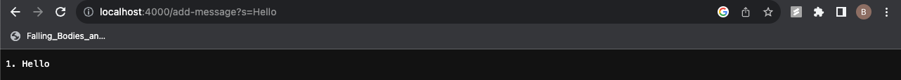
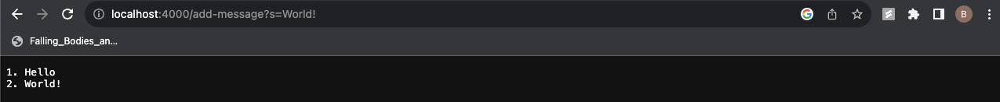

# Lab Report 2 - Servers and SSH Keys 
Write a basic web server.
## Part 1





```java
import java.io.IOException;
import java.net.URI;
import java.util.ArrayList;
import java.util.List;

class Handler implements URLHandler {
    String words = "";
    int number = 1;    

    public String handleRequest(URI url) {
        if (url.getPath().equals("/")) {
            return words.isEmpty() ? "No words in list! Please add a word" : words;       
        } else if (url.getPath().equals("/add-message")) {
            String[] parameters = url.getQuery().split("=");
            if (parameters[0].equals("s")) {
                words  += number + ". " + parameters[1] + "\n";
                number++; 
                return words;
            }
        } 
        return "404 Not Found!";
    } 
}

class SearchEngine {
    public static void main(String[] args) throws IOException {
        if(args.length == 0){
            System.out.println("Missing port number! Try any number between 1024 to 49151");
            return;
        }

        int port = Integer.parseInt(args[0]);

        Server.start(port, new Handler());
    }
}


```
