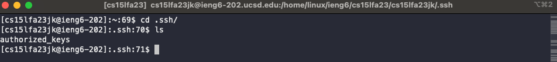
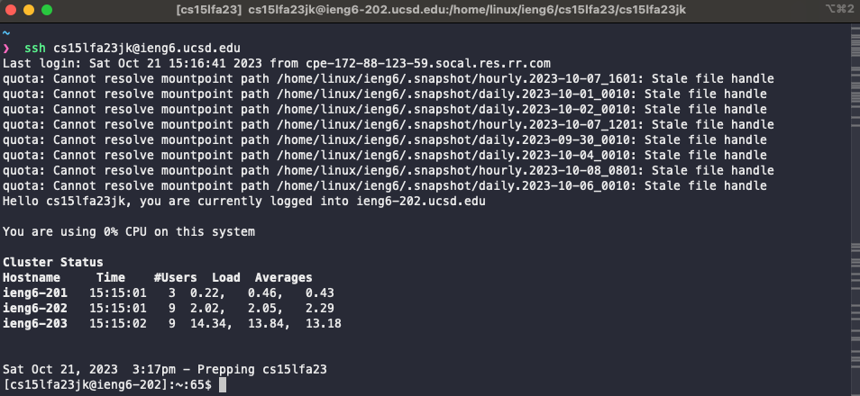

# Lab Report 2 - Servers and SSH Keys 
Write a basic web server.
## Part 1


1. **http://localhost:4000/add-message?s=Hello**
   
   - **Which methods in your code are called?**
     
     `handleRequest(URI url)`
   
   - **What are the relevant arguments to those methods, and the values of any relevant fields of the class?**
     
     The `URI url` argument for `handleRequest` will have the value `http://localhost:4000/add-message?s=Hello`.
     When this method is called, the `words` field is an empty string (if the method was not called prior) and the `number` field is `1` (again, if the method was not called prior).
     
   - **How do the values of any relevant fields of the class change from this specific request? If no values got changed, explain why.**
     
     After the method call, the `words` field will change to:`1.Hello\n`
     ```
     1. Hello
     ```
     and the `number` field will be incremented to `2`.
     

2. **http://localhost:4000/add-message?s=World!**
   
   - **Which methods in your code are called?**
     
     `handleRequest(URI url)`
   
   - **What are the relevant arguments to those methods, and the values of any relevant fields of the class?**
     
     The `URI url` argument for `handleRequest` will have the value `http://localhost:4000/add-message?s=World!`.
    The first method had (`http://localhost:4000/add-message?s=World!`) as a parameter, then at the start of this method call, the `words` field will have the value:`1.Hello\n`
     ```
     1. Hello
     ```
     and the `number` field will be `2`.
     
   - **How do the values of any relevant fields of the class change from this specific request? If no values got changed, explain why.**
     
     After processing this request, the `words` field will change to:`1.Hello\n2.World!\n`
     ```
     1. Hello
     2. World!
     ```
     and the `number` field will be incremented to `3`.

```java
import java.io.IOException;
import java.net.URI;
import java.util.ArrayList;
import java.util.List;

class Handler implements URLHandler {
    String words = "";
    int number = 1;    

    public String handleRequest(URI url) {
        if (url.getPath().equals("/")) {
            return words.isEmpty() ? "No words in list! Please add a word" : words;       
        } else if (url.getPath().equals("/add-message")) {
            String[] parameters = url.getQuery().split("=");
            if (parameters[0].equals("s")) {
                words  += number + ". " + parameters[1] + "\n";
                number++; 
                return words;
            }
        } 
        return "404 Not Found!";
    } 
}

class SearchEngine {
    public static void main(String[] args) throws IOException {
        if(args.length == 0){
            System.out.println("Missing port number! Try any number between 1024 to 49151");
            return;
        }

        int port = Integer.parseInt(args[0]);

        Server.start(port, new Handler());
    }
}
```
## Part 2



