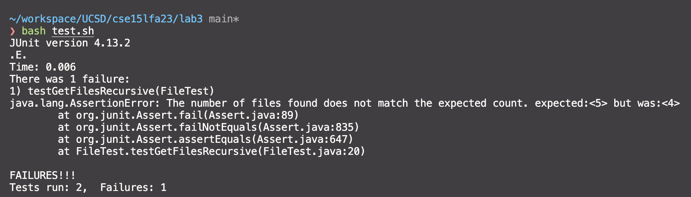

# Lab Report 3 - Lab Report 3 - Bugs and Commands
Finding bugs and researching commands 
## Part 1
The code does not recursively list files in subdirectories, only including the contents of the specified directory.
- - -
A failure-inducing input for the buggy program, as a JUnit test and any associated code (write it as a code block in Markdown)
```bash
some-files/
|-  a.txt
|-  more-files/
    |-  b.txt
    |-  c.java
|-  even-more-files/
    |-  d.java
    |-  a.txt
```

```java
public class FileTest {
    @Test
    public void testRecursion(){
        File start = new File("some-files/");
        
        List<File> files = FileExample.getFiles(start);
        
        int count = 5; 
        
        assertEquals("ERROR! expected count does not match actual count", count, files.size());
        
        assertTrue(files.contains(new File("some-files/a.txt")));
        assertTrue(files.contains(new File("some-files/more-files/b.txt")));
        assertTrue(files.contains(new File("some-files/more-files/c.java")));
        assertTrue(files.contains(new File("some-files/even-more-files/d.java")));
        assertTrue(files.contains(new File("some-files/even-more-files/a.txt")));
    }
  
}
```
- - -
An input that doesn’t induce a failure, as a JUnit test and any associated code (write it as a code block in Markdown)
```java
@Test
    public void testSingleDirectory() throws IOException {
        File start = new File("some-files/a.txt");
        
        List<File> files = FileExample.getFiles(start);
        
       
        final int count = 1; 
        assertEquals("ERROR! expected count does not match actual count", count, files.size());
        
        assertTrue(files.contains(new File("some-files/a.txt")));
    }
```
- - -
The symptom, as the output of running the tests (provide it as a screenshot of running JUnit with at least the two inputs above)

- - -
The bug, as the before-and-after code change required to fix it (as two code blocks in Markdown)
### Before
```java
static List<File> getFiles(File start) throws IOException {
	  File f = start;
	  List<File> result = new ArrayList<>();
	  result.add(start);
	  if(f.isDirectory()) {
	    File[] paths = f.listFiles();
	    for(File subFile: paths) {
	      result.add(subFile);
	    }
	  }
	  return result;
	}
```
### After

```java
	static List<File> getFiles(File start) throws IOException {
	  List<File> result = new ArrayList<>();
        if (start.isDirectory()) {
            File[] files = start.listFiles();
            if (files != null) {
                for (File file : files) {
                    result.addAll(getFiles(file));
                }
            }
        } else {
            result.add(start);
        }
        return result;
	}
```
This change fixes the bug by recursively traversing all directories and collecting files from each directory, not just the top-level directory.
## Part 2
### Less Command
```bash
less -pbecause ./technical/911report/chapter-1.txt

 Hani Hanjour, Khalid al Mihdhar, and Majed Moqed were flagged by CAPPS. The Hazmi brothers were also selected for extra scrutiny by the airline's customer service representative at the check-in counter. He did so because one of the brothers did not have photo identification nor could he understand English, and because the agent found both of the passengers to be suspicious. The only consequence of their selection was that their checked bags were held off the plane until it was confirmed that they had boarded the aircraft.
```
```bash
less -preport ./technical/911report/chapter-1.txt

 None of the checkpoint supervisors recalled the hijackers or reported anything suspicious regarding their screening.
```
Opens the first item that fits the given pattern in a text file on the page.
- - -
```bash
less -N ./technical/911report/chapter-1.txt

1 
2         
3                 
4 "WE HAVE SOME PLANES"
5 
```
```bash
less -N ./technical/911report/chapter-2.txt

1 
2     
3         
4             THE FOUNDATION OF THE NEW TERRORISM
5             A DECLARATION OF WAR
```
Line numbers are shown in front of each line when the `-N` option is used. When you need to consult the line numbers for editing or discussion, this is quite helpful.
- - -
```bash
less -J ./technical/911report/chapter-2.txt

*             It is the story of eccentric and violent ideas sprouting in the fertile ground of
*                 political and social turmoil. It is the story of an organization poised to seize its
*                 historical moment. How did Bin Ladin-with his call for the indiscriminate killing of
                  Americans-win thousands of followers and some degree of approval from millions more?
*             The history, culture, and body of beliefs from which Bin Ladin has shaped and spread
*                 his message are largely unknown to many Americans. Seizing on symbols of Islam's
*                 past greatness, he promises to restore pride to people who consider themselves the
                  victims of successive foreign masters. He uses cultural and religious allusions to
*                 the holy Qur'an and some of its interpreters. He appeals to people disoriented by
*                 cyclonic change as they confront modernity and globalization. His rhetoric
*                 selectively draws from multiple sources-Islam, history, and the region's political
*                 and economic malaise. He also stresses grievances against the United States widely
```
```bash
less -J ./technical/911report/chapter-1.txt

Tuesday, September 11, 2001, dawned temperate and nearly cloudless in the eastern United States. Millio
* ns of men and women readied themselves for work. Some made their way to the Twin Towers, the signature stru
* ctures of the World Trade Center complex in New York City. Others went to Arlington, Virginia, to the Penta
* gon. Across the Potomac River, the United States Congress was back in session. At the other end of Pennsylv
* ania Avenue, people began to line up for a White House tour. In Sarasota, Florida, President George W. Bush
*  went for an early morning run.
```
leaves a status column visible on the screen. The lines that matched the current search are displayed in the status column.
- - -
```bash
less -M ./technical/911report/chapter-2.txt

            THE FOUNDATION OF THE NEW TERRORISM
            A DECLARATION OF WAR
            In February 1998, the 40-year-old Saudi exile Usama Bin Ladin and a fugitive Egyptian
                physician, Ayman al Zawahiri, arranged from their Afghan headquarters for an Arabic
                newspaper in London to publish what they termed a fatwa issued in the name of a

/technical/911report/chapter-2.txt lines 11-30/948 3%
```
```bash
less -M ./technical/911report/chapter-1.txt

    For those heading to an airport, weather conditions could not have been better for a safe and pleasant journey. Among the travelers were Mohamed Atta and Abdul Aziz al Omari, who arrived at the airport in Portland, Maine.

./technical/911report/chapter-1.txt lines 6-16/731 1%
```
When you search with the `-M` option, a more detailed prompt appears, displaying the file name and the current position within the file.