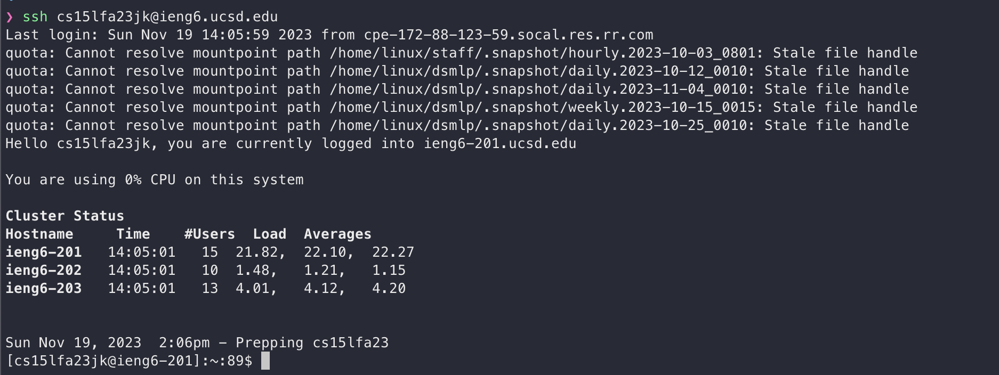
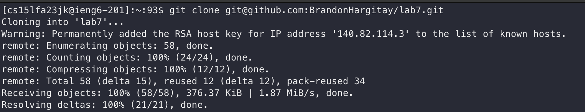
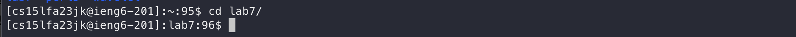

# Lab Report 4 - Vim (Week 7)
Performing shortcuts 
## Steps
1. I opened my terminal and manually typed `ssh cs15lfa23jk@ieng6.ucsd.ed` I found the my typing speed is faster then trying to use the `up` arrow to find my ssh command in the history
 
2. I typed `git clone` prior to starting `step 1` I made sure to copy the github URL so I could use `cmd + v` to paste the URL into my terminal to save time
 
3. I cloned the repo into my home directory so I had to use `cd` to change directory. I typed `cd la` then hit <tab> to auto complete the line then hit <enter> to run the full command which was `cd lab7/`

 