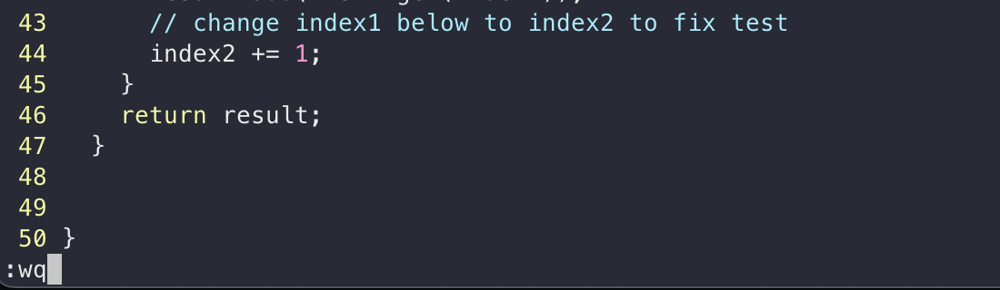

# Lab Report 4 - Vim (Week 7)
Performing Shortcuts 

## Steps

1. I opened my terminal and manually typed `ssh cs15lfa23jk@ieng6.ucsd.edu`. I found that typing the command was faster than using the `<up>` arrow to find my SSH command in the history.
    

2. Before starting step 1, I copied the GitHub URL to my clipboard. Then, I typed `git clone` and used `<cmd>` + `<v>` to paste the URL into my terminal, which saved time.
    

3. After cloning the repo into my home directory, I needed to change directories. I typed `cd la`, pressed `<tab>` to auto-complete, resulting in `cd lab7/`, and then pressed `<enter>`.
    
   
   Inside the `lab7` directory, I ran the test by typing `bash te`, hitting `<tab>` for auto-completion, and then `<enter>`. The full command was `bash test.sh`.
    

4. To address the failing test, I edited the Java file. I typed `<vim Lis>`, pressed `<tab>` for partial auto-completion to `vim ListExamples`, added a `<.>`, pressed `<tab>` again for full completion, and then hit `<enter>` to run `vim ListExamples.java`.
   
   
   The JUnit error indicated an issue on line 44. Instead of repeatedly pressing `<j>`, I entered `<43>` `<j>` to jump directly to line 44. I pressed `<e>` to move to the end of the next word, then `<r>` to replace the letter under the cursor with `<2>`, correcting `index1` to `index2`. To save and exit Vim, I typed `<:wq>`.
   

5. To re-run the test, I typed `<bash te>`, pressed `<tab>` to complete it to `bash test.sh`, and hit `<enter>`. Typing out the command felt quicker than using the `<up>` arrow for previous commands. The tests ran successfully.
   

6. To commit and push the changes, I typed `<git add Li>`, used `<tab>` for auto-completion, and to be more efficient, I combined two commands using `<&&>`. The full command was `git add ListExamples.java && git commit -m "Fix error"`. Finally, I ran `<git push>` to complete the process.
   
