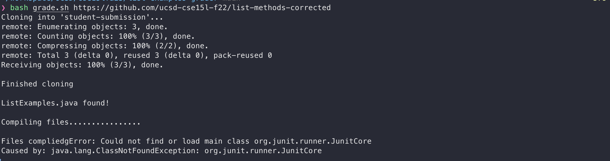

# Lab Report 5 - Remote Acess
Design a debugging scenario
## Part 1 – Debugging Scenario
1. The original post from a student with a screenshot showing a symptom and a description of a guess at the bug/some sense of what the failure-inducing input is. (Don’t actually make the post! Just write the content that would go in such a post)
- - -
Hi everyone, I'm having trouble with my grading script. I run it with bash `grade.sh <GITHUB_URL>`, but it seems to be failing to compile the Java files. I suspect it might be related to the classpath or the JAR files, but I'm not sure. Here's the error message I get:
```console
Error: Could not find or load main class org.junit.runner.JunitCore
Caused by: java.lang.ClassNotFoundException: org.junit.runner.JunitCore
```
 
2. A response from a TA asking a leading question or suggesting a command to try (To be clear, you are mimicking a TA here.)
- - -
The error message suggests there's a problem with finding the necessary classes for JUnit. It might be related to the classpath. Could there be a typo in the path? Could you share your the `javac` command you ran. Also, try running `ls -l lib` to list the contents of your lib directory and share the output. This will help confirm whether the JAR files are in the expected location.
3. Another screenshot/terminal output showing what information the student got from trying that, and a clear description of what the bug is.
- - -
Here is the result of running `ls -l lib` and here is the `javac` command I was running.
```console
❯ ls -l lib
total 840
-rw-r--r--  1 hargy  staff   45024 Nov  7 10:32 hamcrest-core-1.3.jar
-rw-r--r--  1 hargy  staff  384581 Nov  7 10:32 junit-4.13.2.jarj
```
```console
javac -cp .:libb/hamcrest-core-1.3.jar:lib/junit-4.13.2.jar *.jav
```
It looks like the files in `lib` are correct and the bug lines in my `javac` command. I misspelled `lib`, I added a extra b. Fixing the typo solved the bug, my files now complie.
- - -


I ran `ls -l lib`, and the JAR files are there. But I realized the typo in my script. It uses `libb` instead of `lib` in the classpath. That's probably why the script couldn't find the JUnit classes.

4.At the end, all the information needed about the setup,
- **File & Directory Structure Needed**: 
  - `grade.sh` script
  - `TestListExamples.java`
  - `student-submission` directory containing `ListExamples.java`
  - `lib` directory containing `hamcrest-core-1.3.jar` and `junit-4.13.2.jar`
- **Contents of Each File Before Fixing the Bug**: 
  - `grade.sh` script with a typo in the classpath (`libb` instead of `lib`).
- **Full Command Line to Trigger the Bug**: `bash grade.sh <git_hub_url>`
- **Description of What to Edit to Fix the Bug**: 
  - Correct the classpath in the `grade.sh` script from `libb/hamcrest-core-1.3.jar:lib/junit-4.13.2.jar` to `lib/hamcrest-core-1.3.jar:lib/junit-4.13.2.jar`.
## Part 2 – Reflection
During the end half of this quarter, I picked up some really handy shortcuts for using the terminal and Vim, which have been a big help. For instance, in the terminal, I learned to press `Ctrl + R` to quickly find old commands I've used, saving me from typing them out again. In Vim, I found out that hitting `gg` takes me straight to the start of a document, and `Shift + G` jumps to the end, which is super useful for moving around in longer files. Plus, turning line numbers on and off in Vim with `:set number` has made it much easier to keep track of where I am in my code. 
